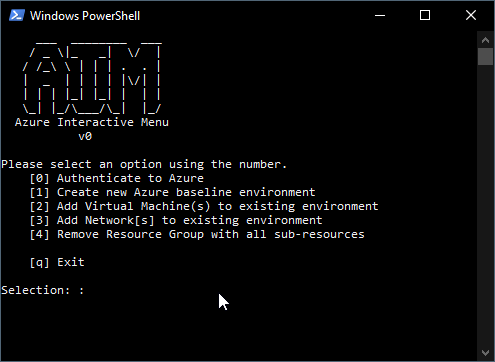

# AIM - Azure Interactive Menu

A work-in-progress interactive menu for setting up various Azure resources.

## TODOs

FIXME: When specifying Windows 10 VM, it creates 2019 Datacenter

- Add single VM to rg
- Add new network to rg
- ~~Log all sessions to file~~
- Log all created resources
- Use resource logs for automatic rollback from menu

## FAQ

*Q: Why not use Terraform or ARM templates?*

A: I want to learn the AZ module

